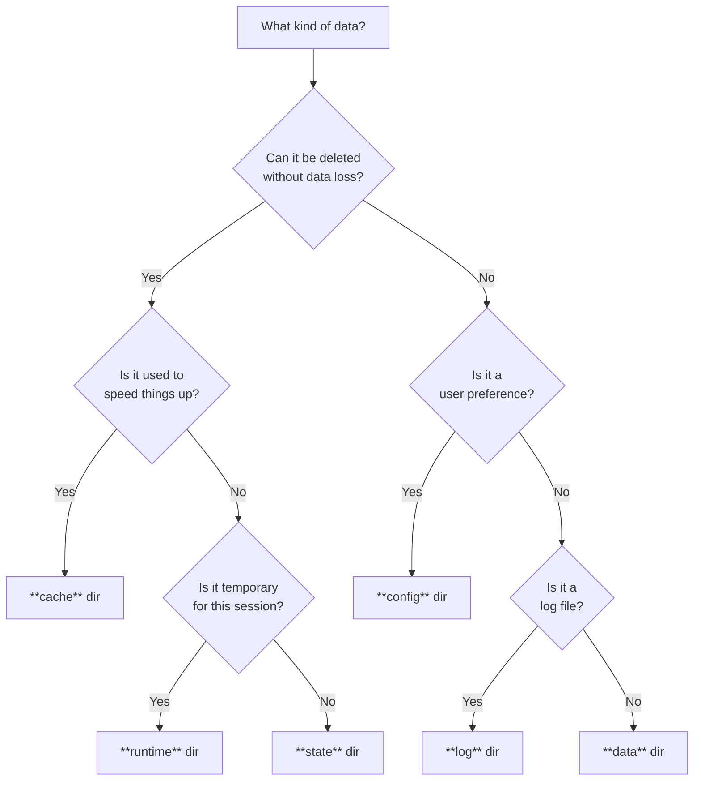

# Understanding platformdirs

## Why platformdirs exists

Every operating system has its own conventions for where applications should store data, configuration, cache, and logs.
A macOS app puts preferences under `~/Library`, a Linux app follows the XDG Base Directory Specification, and a
Windows app uses `AppData`. Hard-coding any of these paths makes an application non-portable.

`platformdirs` solves this by detecting the current platform at runtime and returning the correct directory for each
purpose. Application authors write platform-agnostic code while end users get paths that follow their OS conventions.

## Choosing the right directory

`platformdirs` provides different directory types for different kinds of data. Choose based on the data's purpose and
lifetime.



### Data directories

Use `UserDataDir` and `SiteDataDir` for persistent application data that the user expects to keep:

- SQLite databases, document stores.
- Downloaded files, media assets.
- User-created content.
- Application state that must survive app updates.

```go
dbPath := platformdirs.UserDataPath("MyApp", "", "").Join("app.db")
downloadsDir := platformdirs.UserDataPath("MyApp", "", "").Join("downloads")
```

### Config directories

Use `UserConfigDir` and `SiteConfigDir` for configuration files and user preferences:

- Settings files (JSON, TOML, INI, YAML).
- User preferences and options.
- Application themes, keybindings.
- Feature flags and toggles.

```go
configFile := platformdirs.UserConfigPath("MyApp", "", "").Join("settings.json")
err := os.MkdirAll(configFile.Dir(), 0o777)
if err != nil {
    log.Fatal(err)
}
settings := map[string]any{
    "theme": "dark",
    "auto_save": true,
}
// Write JSON-encoded settings to configFile
```

### Cache directories

Use `UserCacheDir` and `SiteCacheDir` for regenerable data that improves performance:

- API response caches.
- Thumbnail images, processed media.
- Compiled templates, bytecode.
- Downloaded package indexes.

Cached data can be safely deleted without losing functionality. Applications should gracefully handle missing cache
directories.

```go
cacheDir := platformdirs.UserCachePath("MyApp", "", "")
thumbnailCache := cacheDir.Join("thumbnails")
apiCache := cacheDir.Join("api_responses")
```

### State directories

Use `UserStateDir` and `SiteStateDir` for non-critical runtime state:

- Window positions, sizes.
- Recently opened files, MRU lists.
- Undo/redo history.
- Search history, autocomplete data.

State persists between sessions but is less important than data or config. Loss of state is inconvenient but not
catastrophic.

```go
stateFile := platformdirs.UserStatePath("MyApp", "", "").Join("window_state.json")
state := map[string]any{
    "width": 1024,
    "height": 768,
    "maximized": false,
}
err := os.MkdirAll(stateFile.Dir(), 0o777)
if err != nil {
    log.Fatal(err)
}
// Write JSON-encoded state to stateFile
```

### Log directories

Use `UserLogDir` and `SiteLogDir` for application logs:

- Debug logs, error logs.
- Audit trails, access logs.
- Performance metrics.
- Crash reports.

```go
    log_file = user_log_path("MyApp") / "app.log"
    log_file.parent.mkdir(parents=True, exist_ok=True)

    logging.basicConfig(
        filename=log_file,
        level=logging.INFO,
        format="%(asctime)s - %(levelname)s - %(message)s",
    )

logFile := platformdirs.UserLogPath("MyApp", "", "").Join("app.log")
err := os.MkdirAll(logFile.Dir(), 0o777)
if err != nil {
    log.Fatal(err)
}

f, err := os.Create(logFile)
if err != nil {
    log.Fatal(err)
}
slog.SetDefault(slog.New(slog.NewTextHandler(f, nil)))
```

## User vs site directories

Each directory type has both `User*` and `Site*` variants serving different purposes.

<table>
<tbody>
<tr align=center><th>User directories
<tr><td>

User directories (`UserDataDir`, `UserConfigDir`, etc.) are:

- **Per-user**: Each user on the system has their own separate directory.
- **Writable**: Normal users can read and write without special permissions.
- **Isolated**: Changes by one user don't affect others.
- **Default choice**: Use these unless you specifically need system-wide access.

```go
// Each user gets their own config
config := platformdirs.UserConfigPath("MyApp", "", "").Join("config.json")
```

<tbody>
<tr align=center><th>Site directories
<tr><td>

Site directories (``site_data_dir``, ``site_config_dir``, etc.) are:

- **System-wide**: Shared across all users on the machine.
- **Read-only for users**: Typically require administrator/root privileges to write.
- **System defaults**: Store default configurations, shared resources.
- **Package managers**: Used by system package managers for application data.

```go
// Check site config first (system defaults), then user config (overrides)
siteCfg := platformdirs.SiteConfigPath("MyApp", "", "").Join("defaults.json")
userCfg := platformdirs.UserConfigPath("MyApp", "", "").Join("config.json")

var config *filepath.Path
if _, err := os.Stat(userCfg.String()); err != nil {
    config = userCfg
} else if _, err := os.Stat(siteCfg.String()); err != nil {
    config = siteCfg
} else {
    config = nil
}
```

</table>

## Platform conventions

Each operating system has its own conventions for where application data belongs. Understanding these conventions helps
explain why `platformdirs` returns different paths on different platforms.

### macOS

On macOS, `platformdirs` uses the standard Apple `~/Library` directories by default. See [Apple's File System
Programming Guide](https://developer.apple.com/library/archive/documentation/FileManagement/Conceptual/FileSystemProgrammingGuide/FileSystemOverview/FileSystemOverview.html)
for background.

On macOS, `UserDataDir` and `UserConfigDir` both resolve to `~/Library/Application Support/AppName`. If you
need to separate data from config, use subdirectories within that path.

XDG environment variables (`XDG_DATA_HOME`, `XDG_CONFIG_HOME`, `XDG_CACHE_HOME`, etc.) are also supported and take
precedence over the macOS defaults when set. This allows users who prefer the XDG layout to override the default
behavior.

When [Homebrew](https://brew.sh) is installed, `SiteDataDir` and `SiteCacheDir` include the Homebrew prefix as
an additional path when `Multipath: true`.

See [`platformdirs/macos.MacOS`](https://pkg.go.dev/go.jcbhmr.com/platformdirs/macos#MacOS) for the full API reference.

### Windows

On Windows, `platformdirs` uses the Shell Folder APIs to resolve directories. See [Microsoft's Known Folder
documentation](https://docs.microsoft.com/en-us/windows/win32/shell/known-folders) for background.

Key behaviors:

- `appauthor` adds a parent directory: `AppData\Local\<Author>\<App>`. When `appauthor` is `""` (the default),
  it falls back to `appname`, producing a doubled path like `AppData\Local\MyApp\MyApp`. This follows the Windows
  convention of grouping applications by publisher. If your application does not need an author directory, pass
  `AppAuthor: "<nil>"` to get `AppData\Local\MyApp` instead.
- `Roaming: true` switches from `AppData\Local` to `AppData\Roaming`, which syncs across machines in a Windows
  domain. Use roaming for user preferences that should follow the user; use local (default) for machine-specific data
  like caches.
- **OPINION**: `UserCacheDir` appends `\Cache`, `UserLogDir` appends `\Logs`

Unlike Linux/macOS where `XDG_*` variables are a platform standard, Windows has no built-in convention for overriding
folder locations at the application level. To fill this gap, `platformdirs` checks `WIN_PD_OVERRIDE_*` environment
variables before querying the Shell Folder APIs. This is useful when large data (ML models, package caches) should live
on a different drive without changing the system-wide `APPDATA` / `LOCALAPPDATA` variables that other applications
rely on.

The override variable name is `WIN_PD_OVERRIDE_` followed by the CSIDL suffix:

| Environment variable               | Overrides                                               |
| ---------------------------------- | ------------------------------------------------------- |
| `WIN_PD_OVERRIDE_APPDATA`          | Roaming user data (`AppData\Roaming`)                   |
| `WIN_PD_OVERRIDE_LOCAL_APPDATA`    | Local user data, config, cache, state (`AppData\Local`) |
| `WIN_PD_OVERRIDE_COMMON_APPDATA`   | Site-wide data, config, cache, state (`ProgramData`)    |
| `WIN_PD_OVERRIDE_PERSONAL`         | Documents                                               |
| `WIN_PD_OVERRIDE_DOWNLOADS`        | Downloads                                               |
| `WIN_PD_OVERRIDE_MYPICTURES`       | Pictures                                                |
| `WIN_PD_OVERRIDE_MYVIDEO`          | Videos                                                  |
| `WIN_PD_OVERRIDE_MYMUSIC`          | Music                                                   |
| `WIN_PD_OVERRIDE_DESKTOPDIRECTORY` | Desktop                                                 |
| `WIN_PD_OVERRIDE_PROGRAMS`         | Applications (Start Menu Programs)                      |


Empty or whitespace-only values are ignored and the normal resolution applies.

.. note::

    **Windows Store Python (MSIX)**

    Python installed from the Microsoft Store runs in a sandboxed (AppContainer) environment. Windows silently redirects
    writes under ``AppData`` to a per-package private location, e.g.
    ``AppData\Local\Packages\PythonSoftwareFoundation.Python.3.X_<hash>\LocalCache\Local\...``.

    ``platformdirs`` returns the logical ``AppData`` path, which is correct for code running inside the same sandbox.
    However, if you pass these paths to external processes (subprocesses, other applications), those processes may not
    see files created at the logical path because they run outside the sandbox.

    To obtain the real on-disk path for sharing with external processes, call :func:`os.path.realpath` on the path
    **after** the file or directory has been created:

    .. code-block:: python

        import os
        import platformdirs

        data_dir = platformdirs.user_data_dir(
            appname="MyApp", appauthor="Acme", ensure_exists=True
        )
        real_dir = os.path.realpath(data_dir)

    This is a Windows design limitation, not a ``platformdirs`` bug. See `Microsoft's MSIX documentation
    <https://learn.microsoft.com/en-us/windows/msix/desktop/desktop-to-uwp-behind-the-scenes>`_ for details on
    filesystem virtualization.

See :class:`platformdirs.windows.Windows` for the full API reference.

Linux / Unix
============

On Linux and other Unix-like systems, ``platformdirs`` follows the `XDG Base Directory Specification
<https://specifications.freedesktop.org/basedir/latest/>`_.

XDG environment variables override the defaults:

- ``XDG_DATA_HOME`` (default ``~/.local/share``)
- ``XDG_CONFIG_HOME`` (default ``~/.config``)
- ``XDG_CACHE_HOME`` (default ``~/.cache``)
- ``XDG_STATE_HOME`` (default ``~/.local/state``)
- ``XDG_RUNTIME_DIR`` (default ``/run/user/<uid>``)
- ``XDG_DATA_DIRS`` (default ``/usr/local/share:/usr/share``)
- ``XDG_CONFIG_DIRS`` (default ``/etc/xdg``)

When ``multipath=True``, ``site_data_dir`` and ``site_config_dir`` return all paths from the corresponding
``XDG_*_DIRS`` variable, joined by ``:``.

Writing to ``site_*`` directories typically requires root privileges. Normal users can only read from these locations.

**FreeBSD / OpenBSD / NetBSD**: ``user_runtime_dir`` falls back to ``/var/run/user/<uid>`` or ``/tmp/runtime-<uid>``
when ``/run/user/<uid>`` does not exist.

.. note::

    **Running as root**

    When ``use_site_for_root=True`` is passed and the process is running as root (uid 0), ``user_*_dir`` calls are
    redirected to their ``site_*_dir`` equivalents. This is useful for system daemons and installers that should write
    to system-wide directories rather than ``/root/.local/...``. XDG user environment variables (e.g. ``XDG_DATA_HOME``)
    are bypassed when the redirect is active, since they are typically inherited from the calling user via ``sudo`` and
    would defeat the purpose. The parameter is accepted on all platforms but only has an effect on Unix.

See :class:`platformdirs.unix.Unix` for the full API reference.

Android
=======

On Android, ``platformdirs`` uses the app's private storage directories. The app's package folder (e.g.
``/data/data/com.example.app``) is detected via ``python-for-android`` or ``pyjnius``. All directories are within your
app's private storage and data is automatically removed when the app is uninstalled.

Media directories (documents, downloads, pictures, videos, music) point to shared external storage under
``/storage/emulated/0/``. App-private directories don't require storage permissions; external storage access requires
appropriate Android permissions.

**Shell environments**: Android apps like `Termux <https://termux.dev>`_ and Pydroid that function as Linux shells are
detected by the presence of the ``SHELL`` environment variable. In these environments, ``platformdirs`` uses the
Unix/XDG backend instead, including support for ``XDG_*`` environment variables.

See :class:`platformdirs.android.Android` for the full API reference.

*********************
 Real-world examples
*********************

These examples show how popular Python projects use ``platformdirs`` in production. Each example is based on actual code
with links to the source.

Black (code formatter)
======================

`Black <https://github.com/psf/black>`_ uses ``user_cache_path`` to cache formatted files, speeding up repeat runs:

.. code-block:: python

    import os
    from pathlib import Path
    from platformdirs import user_cache_path


    def get_cache_dir() -> Path:
        # Allow customization via environment variable
        default_cache_dir = user_cache_path("black")
        cache_dir = Path(os.environ.get("BLACK_CACHE_DIR", default_cache_dir))
        return cache_dir / __version__


    CACHE_DIR = get_cache_dir()

See `black/cache.py <https://github.com/psf/black/blob/main/src/black/cache.py>`_ for the full implementation.

virtualenv (environment manager)
================================

`virtualenv <https://github.com/pypa/virtualenv>`_ uses ``user_data_dir`` to store application data with fallback to
temp directory if not writable:

.. code-block:: python

    import os
    from platformdirs import user_data_dir


    def get_app_data_dir(env):
        key = "VIRTUALENV_OVERRIDE_APP_DATA"
        if key in env:
            return env[key]
        return user_data_dir(appname="virtualenv", appauthor="pypa")


    folder = get_app_data_dir(os.environ)
    folder = os.path.abspath(folder)

    # Create directory and check writability
    os.makedirs(folder, exist_ok=True)
    if not os.access(folder, os.W_OK):
        # Fallback to temp directory
        folder = tempfile.gettempdir()

See `virtualenv/app_data/__init__.py
<https://github.com/pypa/virtualenv/blob/main/src/virtualenv/app_data/__init__.py>`_ for the full implementation.

Poetry (dependency manager)
===========================

`Poetry <https://github.com/python-poetry/poetry>`_ uses all three directory types with environment variable overrides:

.. code-block:: python

    import os
    from pathlib import Path
    from platformdirs import user_cache_path, user_config_path, user_data_path

    APP_NAME = "pypoetry"

    # Cache directory for downloads and build artifacts
    DEFAULT_CACHE_DIR = user_cache_path(APP_NAME, appauthor=False)

    # Config directory with environment override and roaming enabled
    CONFIG_DIR = Path(
        os.getenv("POETRY_CONFIG_DIR")
        or user_config_path(APP_NAME, appauthor=False, roaming=True)
    )


    # Data directory with environment override
    def data_dir() -> Path:
        if poetry_home := os.getenv("POETRY_HOME"):
            return Path(poetry_home).expanduser()
        return user_data_path(APP_NAME, appauthor=False, roaming=True)

See `poetry/locations.py <https://github.com/python-poetry/poetry/blob/main/src/poetry/locations.py>`_ for the full
implementation.

tox (testing tool)
==================

`tox <https://github.com/tox-dev/tox>`_ uses ``user_config_dir`` for user-level configuration:

.. code-block:: python

    from pathlib import Path
    from platformdirs import user_config_dir

    DEFAULT_CONFIG_FILE = Path(user_config_dir("tox")) / "config.ini"

    # Load config with environment variable override
    config_file = os.getenv("TOX_USER_CONFIG_FILE", DEFAULT_CONFIG_FILE)

See `tox/config/cli/ini.py <https://github.com/tox-dev/tox/blob/main/src/tox/config/cli/ini.py>`_ for the full
implementation.